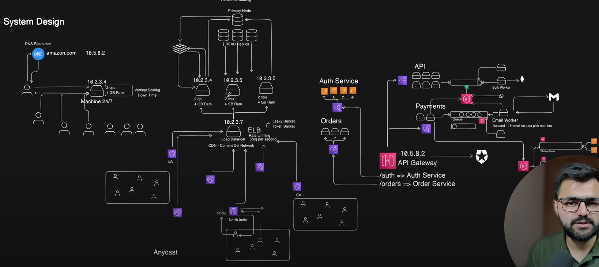

# System Design Concepts Learned

This document summarizes key system design concepts, focusing on client-server architecture, scaling, API gateways, event handling, and optimization techniques like caching and CDNs.

## 1. Client-Server Architecture

- **IP Address and DNS**:
  - Servers are identified by unique IP addresses.
  - Clients send requests to a server’s IP address.
  - Memorizing IP addresses is difficult, so **Domain Name System (DNS)** is used.
  - DNS maps a domain name (e.g., `nadeem.com`) to the server’s IP address.
  - **Process**:
    - Client sends a request to a domain.
    - DNS resolves the domain to an IP address.
    - The request reaches the server, and a response is sent back to the client.

## 2. Scaling

### Vertical Scaling

- **Definition**: Adding more resources (CPU, RAM, storage) to a single server to handle increased load.
- **Process**:
  - Increase resources when load increases.
  - Reduce resources when load decreases.
- **Drawback**:
  - Scaling up/down causes server restarts, leading to **downtime**.
  - Due to downtime, vertical scaling is less preferred.

### Horizontal Scaling

- **Definition**: Adding more servers to distribute the load in parallel.
- **Advantages**:
  - Avoids downtime, as new servers can be added while existing ones handle requests.
- **Challenge**:
  - With multiple servers, DNS provides only one IP address, so how do we distribute requests?
  - Solution: Use a **Load Balancer**.
- **Load Balancer**:
  - Acts as a triage server with a single IP address registered with DNS.
  - Distributes incoming requests equally across multiple servers.

## 3. API Gateway

- **Purpose**: Routes client requests to the appropriate service in a microservices architecture.
- **Microservices**:
  - Each service (e.g., payment, authentication, order) has its own set of horizontally scaled servers and a dedicated load balancer.
- **API Gateway Role**:
  - Acts as a central server that routes requests to the correct service’s load balancer.

## 4. Event Handling with Queues

- **Problem**:
  - Example: A user makes a payment, and you need to send a confirmation email.
  - Email services (e.g., Gmail API) may take time (e.g., 2 minutes) to respond.
  - Waiting for the email response delays processing new payment requests.
- **Solution**: Use an **Asynchronous Queue**.
  - Payment events are stored in a queue.
  - The email service processes events one by one without blocking new payment requests.
- **Benefit**: Enables immediate processing of new requests while handling events in the background.

## 5. Pub/Sub Model (Event-Driven Architecture)

- **Definition**: An architecture where an event triggers multiple services to perform tasks.
- **Example**:
  - A payment event triggers services like email and WhatsApp notifications.
  - **Publisher**: Generates the event (e.g., payment completed).
  - **Subscribers**: Services (e.g., email, WhatsApp) listen to the event and act accordingly.
- **Difference from Queues**:
  - Queues: One service processes events sequentially.
  - Pub/Sub: Multiple services react to the same event simultaneously.

## 6. Fan-Out Architecture

- **Definition**: Combines event-driven architecture with queues.
- **Process**:
  - Events are stored in queues to ensure reliability (e.g., retry on failure).
  - Events are fanned out to multiple services for processing.
- **Benefit**: Ensures no event is lost and allows multiple services to handle the same event.

## 7. Rate Limiting

- **Definition**: Limits the number of API requests to a load balancer to prevent overload.
- **Purpose**:
  - Protects servers from excessive traffic.
  - Ensures fair usage among clients.

## 8. Caching

- **Definition**: Stores frequently accessed data in a fast-access layer (cache) to reduce database load.
- **Process**:
  - Client requests data from the cache.
  - If the cache has the data, it returns it immediately.
  - If not, the request goes to the main database, and the response is stored in the cache for future requests.
- **Benefit**: Optimizes API response times and reduces database load.

## 9. Content Delivery Network (CDN)

- **Definition**: A distributed network of servers (like a global cache) that stores content closer to users.
- **Process**:
  - Requests are routed to the nearest CDN server instead of the main load balancer.
  - CDN serves cached content (e.g., images, videos) to reduce latency.
- **Benefit**: Improves content delivery speed and reduces load on the main server.

---

This summary covers the foundational system design concepts learned, including client-server interactions, scaling strategies, event-driven architectures, and optimization techniques like caching and CDNs.

